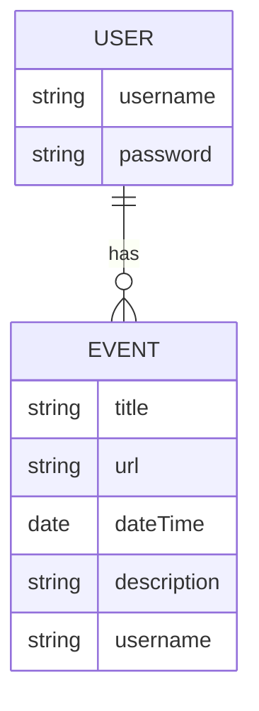

# My Events Backend
- **Creators**: Alexei Rusu, Rene Santiago, Karen Fernander, Cindy Wong
- **Description**: This is an API/Backend system using MongoDB to store information that will allow the user to save any future events they have planned. By using the name, date, time, description, and url of an event any user can save their events for their needs.
- **technologies used**: Express, Javascript, MongoDB, Mongoose, Dotenv, CORS, Morgan

### Models

### Backend Route Table
| Route Name |     URL    | HTTP Verb |        Description        |
|------------|------------|-----------|---------------------------|
|   Index    | /event     |    GET    | Display list of events    |
|   Show     | /event/:id |    GET    | Shows a specific event    |
|   Create   | /event     |    POST   | Add new event to database |
|   Update   | /event/:id |    PUT    | Update a specific event   |
|   Delete   | /event/:id |   DELETE  | Delete a specific event   |

### API
[Deployed Backend Link](https://myevents-backend.onrender.com)

### User Stories
- As a user, I can see a list of all the events when I visit the page
- As a user, I can see detailed information about a specific event
- As a user, I can create a new event and add to the database
- As a user, I can update any specific event if any information were to change
- As a user, I can delete any specific event that I may need removed